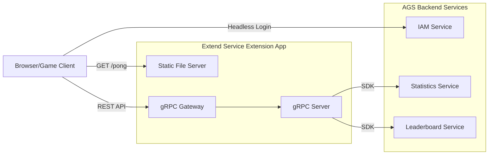

# Pong Game - AGS Extend Service Extension



A classic browser-based Pong game built as an AGS (AccelByte Gaming Services) Extend Service Extension. Features single-player gameplay against an AI opponent with persistent high scores and global leaderboards powered by AGS backend services.

## Features

- **Single Player Mode**: Play against a computer AI with adjustable difficulty
- **Headless Authentication**: Automatic device-based login via AGS IAM
- **High Score Persistence**: Scores saved to AGS Statistics service
- **Global Leaderboard**: Compete with other players via AGS Leaderboard service
- **Built-in Observability**: Metrics, traces, and logs ready for production

## Prerequisites

1. **Development Tools**:
   - Go 1.24+
   - Docker (Docker Desktop 4.30+ / Docker Engine v23.0+)
   - Make

2. **AGS Environment**:
   - Access to an AGS environment (Shared Cloud or Private Cloud)
   - A game namespace
   - OAuth clients configured (see [AGS Configuration](#ags-configuration))

## Quick Start

1. **Clone and configure**:
   ```bash
   cp .env.template .env
   # Edit .env with your AGS credentials
   ```

2. **Run locally**:
   ```bash
   docker compose up --build
   ```

3. **Play the game**:
   Open `http://localhost:8000/pong/` in your browser

## Configuration

### Environment Variables

Create a `.env` file from `.env.template`:

```bash
AB_BASE_URL=https://your-ags-environment.accelbyte.io
AB_NAMESPACE=your-namespace
AB_CLIENT_ID=your-confidential-client-id
AB_CLIENT_SECRET=your-client-secret
PLUGIN_GRPC_SERVER_AUTH_ENABLED=true
BASE_PATH=/pong

# Optional: Use mock services for offline development
AGS_MOCK_ENABLED=false
```

### AGS Configuration

#### OAuth Clients

Two OAuth clients are required:

1. **Public Client** (for frontend headless login):
   - Client Type: Public
   - Used by: Frontend (directly calls AGS IAM for device-based login)

   **Enable Device Login Method:**
   1. Go to **Game Setup** > **3rd Party Configuration** > **Auth & Account Linking**
   2. Click **+ Add New** and select **Device**
   3. Set Redirect URI to `http://127.0.0.1` and click **Create**
   4. Ensure the status shows **ACTIVE** (click **Activate** if needed)

   > See [Implement login with device ID](https://docs.accelbyte.io/gaming-services/getting-started/implement-login-with-device-id/) for details.

2. **Confidential Client** (for backend service):
   - Client Type: Confidential
   - Grant Type: Client Credentials
   - Used by: Backend service to call AGS APIs (Statistics, Leaderboard)
   - Permissions:
     - `ADMIN:ROLE [READ]` - validate user access tokens
     - `ADMIN:NAMESPACE:{namespace}:NAMESPACE [READ]` - validate namespace
     - `ADMIN:NAMESPACE:{namespace}:USER:*:STATITEM [UPDATE]` - update user stats

> **Note**: The backend validates incoming user tokens (from headless login) but uses its own client credentials to call AGS services. This is the standard pattern for Extend Service Extensions.

#### Statistics Setup

Create a statistic in AGS Admin Portal:
- **Code**: `pong-high-score`
- **Name**: Pong High Score
- **Type**: INT
- **Set By**: CLIENT
- **Aggregation**: MAX

#### Leaderboard Setup

Create a leaderboard in AGS Admin Portal:
- **Code**: `pong-leaderboard`
- **Name**: Pong Global Leaderboard
- **Stat Code**: `pong-high-score`
- **Descending**: true

## API Endpoints

| Method | Endpoint | Auth | Description |
|--------|----------|------|-------------|
| POST | `/pong/v1/public/scores` | Bearer Token | Submit player score |
| GET | `/pong/v1/public/leaderboard` | None | Get leaderboard |

Swagger UI available at: `http://localhost:8000/pong/apidocs/`

## Project Structure

```
.
├── main.go                 # Application entry point
├── pkg/
│   ├── proto/
│   │   └── service.proto   # gRPC service definitions
│   ├── pb/                 # Generated gRPC stubs
│   ├── service/
│   │   ├── pongService.go  # Service implementation
│   │   └── ags/            # AGS SDK wrappers
│   └── common/             # Shared utilities & auth
├── static/                 # Frontend game files
│   ├── index.html
│   ├── css/pong.css
│   └── js/
│       ├── game.js         # Game logic
│       ├── api.js          # API client
│       └── config.js       # Configuration
└── gateway/apidocs/        # Generated OpenAPI specs
```

## Development

### Build

```bash
make build
```

### Regenerate Proto Files

```bash
make proto
```

### Run Tests

```bash
go test ./... -cover
```

### Mock Mode

For development without AGS connectivity:

```bash
AGS_MOCK_ENABLED=true docker compose up --build
```

## Ports

| Port | Service |
|------|---------|
| 8000 | HTTP (REST API + Static Files + Swagger UI) |
| 6565 | gRPC Server |
| 8080 | Prometheus Metrics (`/metrics`) |

## Deployment

1. **Create an Extend Service Extension app** in AGS Admin Portal

2. **Configure secrets** in the app's Environment Configuration:
   - `AB_CLIENT_ID`
   - `AB_CLIENT_SECRET`

3. **Build and push the container image**:
   ```bash
   extend-helper-cli image-upload --login --namespace <namespace> --app <app-name> --image-tag v0.0.1
   ```

4. **Deploy the image** from the AGS Admin Portal

## Observability

The service includes built-in instrumentation:
- **Metrics**: Prometheus endpoint at `:8080/metrics`
- **Traces**: OpenTelemetry support
- **Logs**: Structured logging with Logrus

For local observability testing, use [grpc-plugin-dependencies](https://github.com/AccelByte/grpc-plugin-dependencies) to run Grafana, Loki, and Prometheus.

## References

- [AGS Extend Service Extension Documentation](https://docs.accelbyte.io/gaming-services/services/extend/service-extension/)
- [AccelByte Go SDK](https://github.com/AccelByte/accelbyte-go-sdk)
- [AGS Statistics Service](https://docs.accelbyte.io/gaming-services/services/statistics/)
- [AGS Leaderboard Service](https://docs.accelbyte.io/gaming-services/services/leaderboard/)
