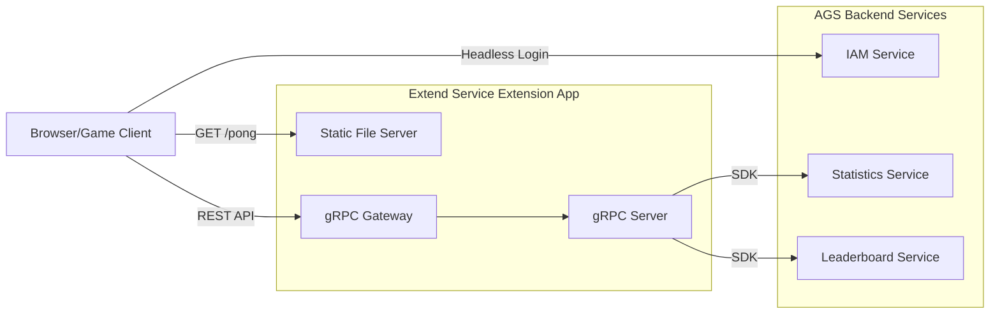

# Pong Game Tech Spec

## Overview

This document outlines the technical specification for modifying the AGS Extend Service Extension template to serve a classic Pong game with integrated AccelByte Gaming Services (AGS) backend functionality. The implementation will feature a single-player Pong game (player vs computer) with headless authentication, high score persistence, and leaderboard functionality.

## Architecture



## System Components

### 1. Frontend (Browser-based Pong Game)

#### Technology Stack
- HTML5 Canvas for game rendering
- JavaScript (Vanilla or lightweight framework)
- CSS for UI styling
- Fetch API for REST communication

#### Game Features
- **Single Player Mode**: Player vs Computer AI
- **Game Mechanics**:
  - Ball physics with velocity and collision detection
  - Player paddle controlled by keyboard (Arrow keys or W/S)
  - Computer AI with difficulty scaling
  - Score tracking (first to 11 points wins)
- **UI Components**:
  - Game canvas (800x600px recommended)
  - Score display
  - High score display
  - Leaderboard panel
  - Login status indicator
  - Game over screen with score submission

#### Frontend-Backend Integration
The frontend will make the following API calls:
- **Direct to AGS IAM**: `POST https://{ags-base-url}/iam/v3/oauth/platforms/device/token` - Headless login
- **To Backend Service**:
  - `POST /v1/public/namespace/{namespace}/scores` - Submit high score
  - `GET /v1/public/namespace/{namespace}/leaderboard` - Fetch leaderboard

### 2. Backend (gRPC Service with REST Gateway)

#### Service Definition (service.proto)

Replace existing guild service with Pong service endpoints:

```protobuf
service PongService {
  // Submit player's score to AGS Statistics
  rpc SubmitScore (SubmitScoreRequest) returns (SubmitScoreResponse);

  // Get leaderboard from AGS
  rpc GetLeaderboard (GetLeaderboardRequest) returns (GetLeaderboardResponse);
}
```

**Note**: Headless login is removed from the backend service as it will be called directly from the frontend to AGS IAM.

#### Message Definitions

```protobuf
message SubmitScoreRequest {
  string namespace = 1;
  string user_id = 2;
  int32 score = 3;
  map<string, string> metadata = 4;  // Optional: game duration, difficulty, etc.
}

message SubmitScoreResponse {
  bool success = 1;
  string message = 2;
}

message GetLeaderboardRequest {
  string namespace = 1;
  int32 limit = 2;  // Default: 10, Max: 100
  int32 offset = 3;
}

message LeaderboardEntry {
  int32 rank = 1;
  string user_id = 2;
  int32 score = 3;
  int64 timestamp = 4;
}

message GetLeaderboardResponse {
  repeated LeaderboardEntry entries = 1;
  int32 total_count = 2;
}
```

#### REST API Endpoints

Via gRPC Gateway annotations:

- `POST /v1/public/namespace/{namespace}/scores` - Requires bearer token
- `GET /v1/public/namespace/{namespace}/leaderboard` - Public access (no token required)

### 3. Static File Serving

Add static file serving capability to serve the Pong game HTML/JS/CSS:

- Serve `index.html` at `/pong` or `/`
- Serve static assets (JS, CSS, images) from `/static/` directory
- Configure in `main.go` using standard Go HTTP file server

#### Directory Structure
```
static/
├── index.html          # Main game page
├── css/
│   └── pong.css        # Game styling
├── js/
│   ├── game.js         # Core game logic
│   ├── api.js          # API client wrapper
│   └── config.js       # Game configuration
└── assets/
    └── (optional images/sounds)
```

### 4. AGS Integration

#### IAM Service (Headless Login)
- Frontend directly calls AGS IAM REST API (no backend involvement)
- Flow:
  1. Generate or retrieve device ID from browser (localStorage)
  2. Frontend directly calls `POST https://{ags-base-url}/iam/v3/oauth/platforms/device/token`
  3. Request includes OAuth client credentials (basic auth) and device ID
  4. AGS IAM returns access token and user ID
  5. Frontend stores token in browser (sessionStorage/localStorage)
- Backend service does NOT handle authentication

#### Statistics Service
- Use AccelByte Go SDK's Statistics service
- Create stat configuration in AGS Admin Portal:
  - Stat Code: `pong_high_score`
  - Type: `INT`
  - Aggregation: `MAX`
  - Visibility: `PUBLIC`
- Backend will call `UpdateUserStatItems` with the player's score
- Only update if new score is higher than existing

#### Leaderboard Service
- Use AccelByte Go SDK's Leaderboard service
- Configure leaderboard in AGS Admin Portal:
  - Leaderboard Code: `pong_leaderboard`
  - Stat Code: `pong_high_score`
  - Sort Order: `DESCENDING`
  - Cycle: `ALLTIME` or `WEEKLY` (configurable)
- Backend will call `GetLeaderboardRankingPublicV1` to fetch top scores

## Implementation Plan

### Phase 1: Backend Service Modification

1. **Update Protocol Buffers**
   - Modify `pkg/proto/service.proto` with Pong service definitions
   - Update gRPC Gateway annotations for REST mapping
   - Regenerate Go stubs using `make proto`

2. **Implement Service Handlers**
   - Create `pkg/service/pongService.go`
   - Implement `SubmitScore()`:
     - Access token validation handled by interceptor
     - Call Statistics service to update user stat
     - Handle duplicate/lower score scenarios
   - Implement `GetLeaderboard()`:
     - Call Leaderboard service
     - Format and return top N entries

3. **Update Authentication Interceptor**
   - Modify `pkg/common/authServerInterceptor.go`
   - Enforce token validation for `SubmitScore`
   - Allow public access (no token required) for `GetLeaderboard`

4. **Add Static File Server**
   - Update `main.go` to serve static files
   - Mount static file handler at `/` or `/pong`
   - Ensure API routes take precedence over static routes

### Phase 2: Frontend Implementation

1. **Game Engine**
   - Implement canvas-based Pong game
   - Ball physics: velocity, collision detection, bounds checking
   - Paddle mechanics: player input, AI opponent
   - Score tracking and win conditions

2. **API Client**
   - Create API wrapper functions for backend service
   - Create direct AGS IAM client for headless login
   - Implement device ID management (localStorage)
   - Handle headless login on page load (direct to AGS)
   - Token storage and retrieval (sessionStorage/localStorage)
   - Token refresh logic (if needed)

3. **UI Integration**
   - Score display (real-time during game)
   - High score display (from leaderboard)
   - Leaderboard table (top 10)
   - Game over screen with score submission
   - Error handling and loading states

### Phase 3: AGS Configuration

1. **Create AGS Resources**
   - Namespace setup (if not exists)
   - IAM OAuth client configuration
   - Statistics configuration (`pong_high_score`)
   - Leaderboard configuration (`pong_leaderboard`)

2. **Environment Variables**
   - Update `.env` file with required credentials
   - Set `BASE_PATH=/pong`
   - Configure `PLUGIN_GRPC_SERVER_AUTH_ENABLED=true`

### Phase 4: Testing & Deployment

1. **Local Testing**
   - Test headless login flow
   - Verify score submission
   - Validate leaderboard retrieval
   - End-to-end gameplay testing
   - Test with multiple concurrent users

2. **Deploy to AGS**
   - Build Docker image
   - Upload using `extend-helper-cli`
   - Configure environment secrets in AGS Portal
   - Deploy and verify

## Technical Considerations

### Security
- Headless login creates anonymous accounts tied to device ID
- Access tokens required for score submission (prevents unauthorized updates)
- Consider rate limiting on score submission
- Input validation on all API endpoints
- CORS configuration for browser access

### Performance
- Lightweight game engine (target 60 FPS)
- Minimize API calls (batch leaderboard fetches)
- Cache leaderboard data (client-side, 30s TTL)
- Optimize static asset delivery (minification, gzip)

### Scalability
- Stateless backend (horizontal scaling supported)
- AGS services handle data persistence
- No server-side game state (all game logic client-side)

### User Experience
- Responsive design (mobile-friendly)
- Loading indicators for API calls
- Graceful error handling
- Offline play detection (disable score submission)

## Configuration

### Backend Environment Variables

```bash
AB_BASE_URL='https://demo.accelbyte.io'
AB_CLIENT_ID='<oauth_client_id>'
AB_CLIENT_SECRET='<oauth_client_secret>'
AB_NAMESPACE='<namespace>'
PLUGIN_GRPC_SERVER_AUTH_ENABLED=true
BASE_PATH='/pong'
ENABLE_STATIC_SERVER=true
STATIC_FILES_PATH='./static'
```

### Frontend Configuration (embedded in JavaScript)

```javascript
const CONFIG = {
  AGS_BASE_URL: 'https://demo.accelbyte.io',
  NAMESPACE: 'your-namespace',
  CLIENT_ID: 'your-public-client-id',  // Public OAuth client for headless login
  BACKEND_URL: window.location.origin + '/pong'
};
```

**Note**: The OAuth client ID exposed in the frontend should be a **public client** (not confidential) configured for device platform authentication.

### AGS Portal Configuration

#### OAuth Client Setup

Two OAuth clients are required:

1. **Public Client** (for frontend headless login)
   - Client Type: **Public**
   - Grant Type: Device
   - Redirect URI: Not required for headless
   - Permissions:
     - `NAMESPACE:{namespace}:USER:*` (for headless account creation)

2. **Confidential Client** (for backend service)
   - Client Type: **Confidential**
   - Grant Type: Client Credentials
   - Permissions:
     - `ADMIN:ROLE [READ]` to validate access token and permissions
     - `ADMIN:NAMESPACE:{namespace}:NAMESPACE [READ]` to validate access namespace
     - `NAMESPACE:{namespace}:STATISTIC:*` (for statistics updates)
     - `NAMESPACE:{namespace}:LEADERBOARD:*` (for leaderboard read)

#### Statistics Setup
- Code: `pong_high_score`
- Name: "Pong High Score"
- Type: INT
- Set By: CLIENT
- Aggregation: MAX
- Status: ACTIVE

#### Leaderboard Setup
- Code: `pong_leaderboard`
- Name: "Pong Global Leaderboard"
- Stat Code: `pong_high_score`
- Descending: true
- Start Time: (current date)
- Reset: ALLTIME or WEEKLY

## API Reference

### AGS IAM Headless Login (Direct from Frontend)

**Endpoint:** `POST https://{ags-base-url}/iam/v3/oauth/platforms/device/token`

**Headers:**
- `Authorization: Basic <base64(client_id:client_secret)>` (for public client, client_secret can be empty)
- `Content-Type: application/x-www-form-urlencoded`

**Request Body (form-encoded):**
```
device_id={device_id}&
namespace={namespace}
```

**Response:**
```json
{
  "access_token": "eyJhbGc...",
  "expires_in": 3600,
  "token_type": "Bearer",
  "user_id": "abc123",
  "display_name": "DeviceUser123",
  "namespace": "your-namespace"
}
```

### POST /v1/public/namespace/{namespace}/scores

**Headers:**
- `Authorization: Bearer <access_token>`

**Request Body:**
```json
{
  "user_id": "abc123",
  "score": 15,
  "metadata": {
    "game_duration": "120",
    "difficulty": "medium"
  }
}
```

**Response:**
```json
{
  "success": true,
  "message": "Score submitted successfully"
}
```

### GET /v1/public/namespace/{namespace}/leaderboard?limit=10&offset=0

**Response:**
```json
{
  "entries": [
    {
      "rank": 1,
      "user_id": "user123",
      "score": 42,
      "timestamp": 1701234567
    }
  ],
  "total_count": 100
}
```

## Testing Strategy

### Unit Tests
- Service handler functions
- AGS SDK integration mocks
- Input validation
- Error handling

### Integration Tests
- Full API endpoint testing
- AGS service connectivity
- Token validation flow

### E2E Tests
- Complete game flow (login -> play -> submit -> leaderboard)
- Multiple concurrent users
- Edge cases (network failures, invalid tokens)

## Monitoring & Observability

- Leverage existing Grafana/Loki/Prometheus setup
- Add custom metrics:
  - Headless login success/failure rate
  - Score submission count
  - Leaderboard fetch latency
  - Game session duration
- Log all API errors with structured logging

## Future Enhancements (Out of Scope)

- Multiplayer mode (requires WebSocket/real-time communication)
- Multiple difficulty levels
- Power-ups and special effects
- Social features (friend leaderboards)
- Achievements integration
- Match history
- Custom paddle/ball skins
- Sound effects and music

## References

- [AGS Extend Service Extension Documentation](https://docs.accelbyte.io/gaming-services/services/extend/service-extension/)
- [AccelByte Go SDK](https://github.com/AccelByte/accelbyte-go-sdk)
- [AGS Statistics Service](https://docs.accelbyte.io/gaming-services/services/statistics/)
- [AGS Leaderboard Service](https://docs.accelbyte.io/gaming-services/services/leaderboard/)
- [AGS IAM Service](https://docs.accelbyte.io/gaming-services/services/access/)
- [gRPC Gateway](https://github.com/grpc-ecosystem/grpc-gateway)

## Appendices

### Appendix A: Game Constants

```javascript
const GAME_CONFIG = {
  CANVAS_WIDTH: 800,
  CANVAS_HEIGHT: 600,
  PADDLE_WIDTH: 10,
  PADDLE_HEIGHT: 100,
  BALL_SIZE: 10,
  BALL_SPEED: 5,
  PADDLE_SPEED: 8,
  WINNING_SCORE: 11,
  AI_DIFFICULTY: 0.7  // 0.0 (easy) to 1.0 (hard)
};
```

### Appendix B: Device ID Generation & Headless Login

```javascript
// Generate persistent device ID
function getDeviceId() {
  let deviceId = localStorage.getItem('pong_device_id');
  if (!deviceId) {
    deviceId = 'pong_' + Math.random().toString(36).substr(2, 9) +
               Date.now().toString(36);
    localStorage.setItem('pong_device_id', deviceId);
  }
  return deviceId;
}

// Headless login to AGS IAM (direct call)
async function headlessLogin() {
  const deviceId = getDeviceId();
  const credentials = btoa(`${CONFIG.CLIENT_ID}:`); // Public client, no secret

  const response = await fetch(`${CONFIG.AGS_BASE_URL}/iam/v3/oauth/platforms/device/token`, {
    method: 'POST',
    headers: {
      'Authorization': `Basic ${credentials}`,
      'Content-Type': 'application/x-www-form-urlencoded'
    },
    body: new URLSearchParams({
      'device_id': deviceId,
      'namespace': CONFIG.NAMESPACE
    })
  });

  const data = await response.json();

  // Store token and user info
  sessionStorage.setItem('access_token', data.access_token);
  sessionStorage.setItem('user_id', data.user_id);

  return data;
}
```

### Appendix C: Error Codes

| Code | Description | Action |
|------|-------------|--------|
| AUTH_001 | Headless login failed | Retry with new device ID |
| SCORE_001 | Invalid access token | Re-authenticate |
| SCORE_002 | Score validation failed | Check score format |
| LB_001 | Leaderboard unavailable | Display cached data |

---

**Document Version:** 1.0
**Last Updated:** 2025-11-27
**Author:** Technical Specification
**Status:** Draft
