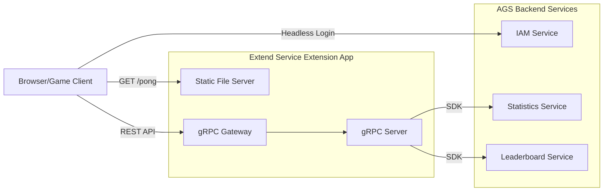
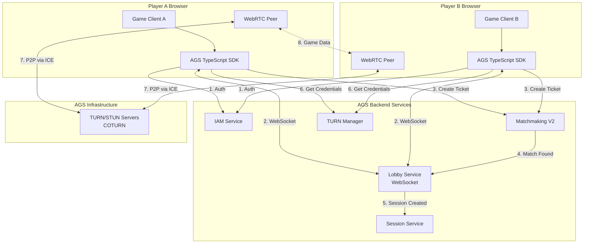
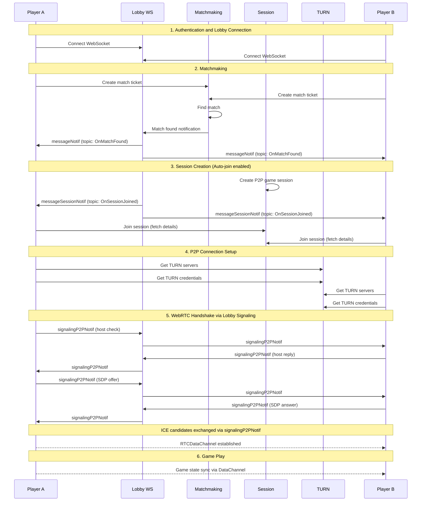
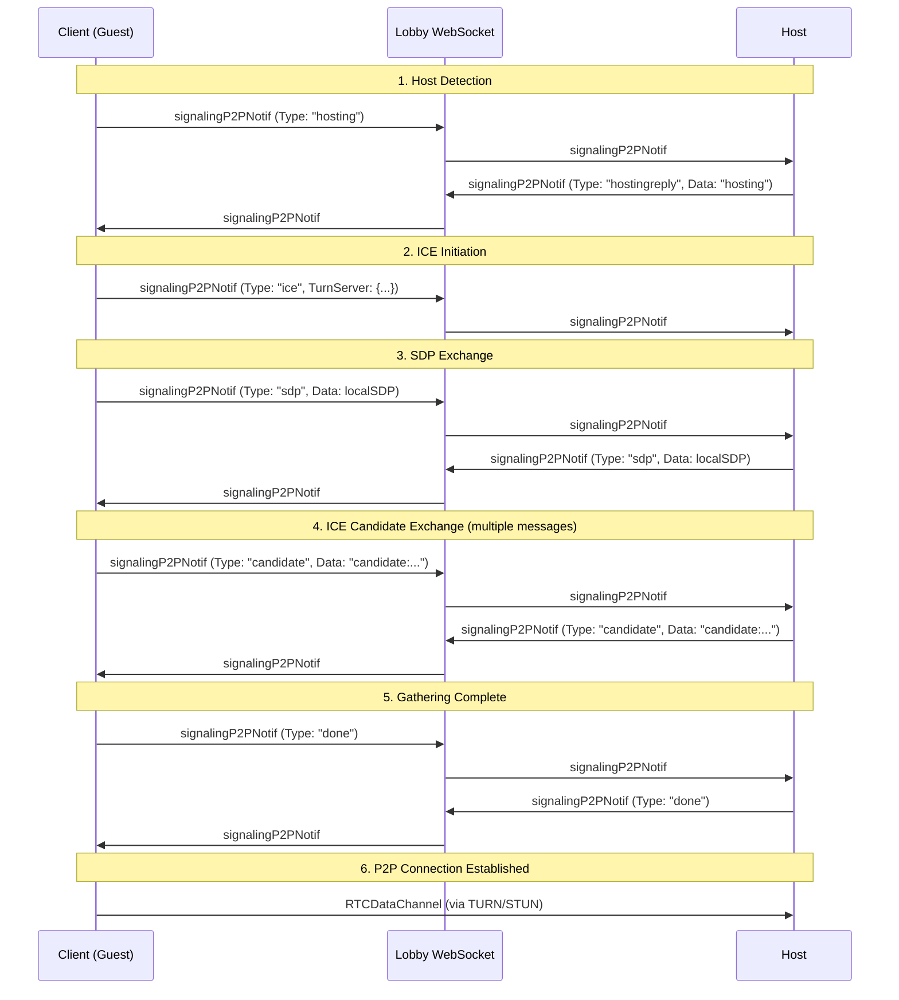

# Pong Game Tech Spec

## Overview

This document outlines the technical specification for modifying the AGS Extend Service Extension template to serve a classic Pong game with integrated AccelByte Gaming Services (AGS) backend functionality. The implementation features:

- **Single-player Mode**: Player vs Computer AI with headless authentication, high score persistence, and leaderboard functionality
- **Multiplayer Mode**: Real-time P2P multiplayer using AGS Matchmaking, Session Service, and TURN relay servers with WebRTC

## Architecture

### Single-Player Architecture



### Multiplayer Architecture



### Service Base Path

The service is configured with a base path of `/pong`. All REST API endpoints and static files are served under this path:
- Static files: `/pong/` (game UI)
- REST API: `/pong/v1/public/namespace/{namespace}/...`

## System Components

### 1. Frontend (Browser-based Pong Game)

#### Technology Stack
- HTML5 Canvas for game rendering
- JavaScript (Vanilla or lightweight framework)
- CSS for UI styling
- Fetch API for REST communication

#### Game Features
- **Single Player Mode**: Player vs Computer AI
- **Multiplayer Mode**: Real-time P2P player vs player
- **Game Mechanics**:
  - Ball physics with velocity and collision detection
  - Player paddle controlled by keyboard (Arrow keys or W/S)
  - Computer AI with difficulty scaling (single-player)
  - Score tracking (first to 11 points wins)
- **UI Components**:
  - Game canvas (800x600px recommended)
  - Score display
  - High score display
  - Leaderboard panel
  - Login status indicator
  - Game over screen with score submission
  - **Multiplayer UI**:
    - Mode selection (Single Player / Multiplayer)
    - Matchmaking queue with status indicator
    - Connection quality indicator
    - Opponent info display
    - P2P connection status overlay

#### Multiplayer UI States

The multiplayer UI displays different states throughout the matchmaking and P2P connection flow:

| State | UI Display | Description |
|-------|------------|-------------|
| `IDLE` | "Find Match" button | Ready to start matchmaking |
| `QUEUING` | Spinner + "Searching for opponent..." + Cancel button | Matchmaking in progress |
| `MATCHED` | "Match found!" + opponent info | Brief transition state |
| `JOINING` | "Joining session..." | Joining the game session |
| `CONNECTING` | P2P connection overlay (see below) | WebRTC handshake in progress |
| `PLAYING` | Game canvas + connection indicator | Active gameplay |
| `RECONNECTING` | "Reconnecting..." overlay on game | Attempting to restore connection |
| `FINISHED` | Game over screen + stats | Match complete |

#### P2P Connection Status Overlay

During the `CONNECTING` state, display a detailed overlay showing signaling progress:

```
┌─────────────────────────────────────────┐
│                                         │
│         Connecting to opponent          │
│                                         │
│    ● Checking peer status...      [✓]   │
│    ● Exchanging connection info...  ◌   │
│    ○ Gathering network paths...         │
│    ○ Establishing connection...         │
│                                         │
│              [Cancel]                   │
│                                         │
└─────────────────────────────────────────┘

Legend: ● Complete  ◌ In Progress  ○ Pending  [✓] Success  [✗] Failed
```

**P2P Connection Sub-states:**

| Sub-state | Display Text | Signaling Phase |
|-----------|--------------|-----------------|
| `HOST_CHECK` | "Checking peer status..." | Sending/receiving `hosting`/`hostingreply` |
| `ICE_OFFER` | "Exchanging connection info..." | Sending `ice` offer with TURN config |
| `SDP_EXCHANGE` | "Exchanging connection info..." | SDP offer/answer exchange |
| `GATHERING` | "Gathering network paths..." | ICE candidate exchange |
| `ESTABLISHING` | "Establishing connection..." | Final ICE negotiation |
| `CONNECTED` | (Overlay closes, game starts) | DataChannel open |

#### Connection Quality Indicator

Once connected, display a persistent connection indicator during gameplay:

```javascript
const CONNECTION_INDICATORS = {
  // Connection type badges
  DIRECT: { icon: '🟢', label: 'Direct', color: '#4CAF50' },
  STUN:   { icon: '🟡', label: 'STUN', color: '#FFC107' },
  RELAY:  { icon: '🟠', label: 'Relay', color: '#FF9800' },

  // Quality based on latency
  EXCELLENT: { icon: '●●●●', threshold: 50 },   // < 50ms
  GOOD:      { icon: '●●●○', threshold: 100 },  // 50-100ms
  FAIR:      { icon: '●●○○', threshold: 200 },  // 100-200ms
  POOR:      { icon: '●○○○', threshold: Infinity } // > 200ms
};
```

**UI Layout during gameplay:**
```
┌────────────────────────────────────────────────────────────┐
│  You: 3          [🟢 Direct 32ms]          Opponent: 5     │
├────────────────────────────────────────────────────────────┤
│                                                            │
│    │                                              │        │
│    │                      ●                       │        │
│    │                                              │        │
│                                                            │
└────────────────────────────────────────────────────────────┘
```

#### Error State UI

Display appropriate error messages with recovery options:

| Error | Display | Actions |
|-------|---------|---------|
| Host not responding | "Opponent not ready. Please wait..." | Auto-retry (3x), then "Return to Menu" |
| ICE gathering failed | "Network error. Check your connection." | "Retry" / "Return to Menu" |
| Connection timeout | "Connection timed out." | "Retry" / "Return to Menu" |
| Peer disconnected | "Opponent disconnected." | "Wait for reconnect" (10s) / "Leave Match" |
| TURN server unavailable | "Server connection failed." | "Retry" / "Return to Menu" |

**Error Overlay Example:**
```
┌─────────────────────────────────────────┐
│                                         │
│         ⚠️ Connection Failed            │
│                                         │
│    Connection timed out while           │
│    trying to reach your opponent.       │
│                                         │
│       [Retry]    [Return to Menu]       │
│                                         │
└─────────────────────────────────────────┘
```

#### Frontend-Backend Integration
The frontend will make the following API calls:
- **Direct to AGS IAM**: `POST https://{ags-base-url}/iam/v3/oauth/platforms/device/token` - Headless login
- **To Backend Service**:
  - `POST /v1/public/namespace/{namespace}/scores` - Submit high score
  - `GET /v1/public/namespace/{namespace}/leaderboard` - Fetch leaderboard

### 2. Backend (gRPC Service with REST Gateway)

#### Service Definition (service.proto)

Replace existing guild service with Pong service endpoints:

```protobuf
service PongService {
  // Submit player's score to AGS Statistics
  rpc SubmitScore (SubmitScoreRequest) returns (SubmitScoreResponse);

  // Get leaderboard from AGS
  rpc GetLeaderboard (GetLeaderboardRequest) returns (GetLeaderboardResponse);
}
```

**Note**: Headless login is removed from the backend service as it will be called directly from the frontend to AGS IAM.

#### Message Definitions

```protobuf
message SubmitScoreRequest {
  string namespace = 1;
  string user_id = 2;
  int32 score = 3;
  map<string, string> metadata = 4;  // Optional: game duration, difficulty, etc.
}

message SubmitScoreResponse {
  bool success = 1;
  string message = 2;
}

message GetLeaderboardRequest {
  string namespace = 1;
  int32 limit = 2;  // Default: 10, Max: 100
  int32 offset = 3;
}

message LeaderboardEntry {
  int32 rank = 1;
  string user_id = 2;
  int32 score = 3;
  int64 timestamp = 4;
}

message GetLeaderboardResponse {
  repeated LeaderboardEntry entries = 1;
  int32 total_count = 2;
}
```

#### REST API Endpoints

Via gRPC Gateway annotations:

- `POST /v1/public/namespace/{namespace}/scores` - Requires bearer token
- `GET /v1/public/namespace/{namespace}/leaderboard` - Public access (no token required)

### 3. Static File Serving

Add static file serving capability to serve the Pong game HTML/JS/CSS:

- Serve `index.html` at `/pong` or `/`
- Serve static assets (JS, CSS, images) from `/static/` directory
- Configure in `main.go` using standard Go HTTP file server

#### Directory Structure
```
static/
├── index.html          # Main game page
├── css/
│   └── pong.css        # Game styling
├── js/
│   ├── game.js         # Core game logic
│   ├── api.js          # API client wrapper
│   └── config.js       # Game configuration
└── assets/
    └── (optional images/sounds)
```

### 4. AGS Integration

#### IAM Service (Headless Login)
- Frontend directly calls AGS IAM REST API (no backend involvement)
- Flow:
  1. Generate or retrieve device ID from browser (localStorage)
  2. Frontend directly calls `POST https://{ags-base-url}/iam/v3/oauth/platforms/device/token`
  3. Request includes OAuth client credentials (basic auth) and device ID
  4. AGS IAM returns access token and user ID
  5. Frontend stores token in browser (sessionStorage/localStorage)
- Backend service does NOT handle authentication

#### Statistics Service
- Use AccelByte Go SDK's Statistics service
- Create stat configuration in AGS Admin Portal:
  - Stat Code: `pong-high-score`
  - Type: `INT`
  - Aggregation: `MAX`
  - Visibility: `PUBLIC`
- Backend will call `UpdateUserStatItems` with the player's score
- Only update if new score is higher than existing

#### Leaderboard Service
- Use AccelByte Go SDK's Leaderboard service
- Configure leaderboard in AGS Admin Portal:
  - Leaderboard Code: `pong-leaderboard`
  - Stat Code: `pong-high-score`
  - Sort Order: `DESCENDING`
  - Cycle: `ALLTIME` or `WEEKLY` (configurable)
- Backend will call `GetLeaderboardRankingPublicV1` to fetch top scores

## Multiplayer Mode

### Overview

The multiplayer mode enables real-time player-vs-player Pong matches using AGS's P2P infrastructure. The implementation leverages:

- **AGS Matchmaking V2**: Queue players and find suitable opponents
- **AGS Session Service**: Manage game sessions with P2P type
- **AGS Lobby Service**: WebSocket for real-time notifications
- **AGS TURN Manager**: Provide TURN/STUN credentials for NAT traversal
- **WebRTC**: Browser-native P2P communication via RTCDataChannel

### Technology Stack (Multiplayer)

```
Frontend Implementation:
├── Vanilla JavaScript       # No framework dependencies
├── Direct REST API calls    # AGS Matchmaking, Session, TURN APIs
├── Native WebSocket         # AGS Lobby WebSocket connection
└── Native WebRTC API        # P2P data channels
```

### Multiplayer Flow



### AGS Services Configuration

#### Session Template (P2P)

Create in AGS Admin Portal under **Multiplayer > Session Configuration**:

| Setting | Value |
|---------|-------|
| Name | `pong-p2p-session` |
| Type | `P2P` |
| Joinability | `INVITE_ONLY` |
| Min Players | `2` |
| Max Players | `2` |
| Invite Timeout | `30` seconds |
| Inactive Timeout | `60` seconds |
| Text Chat | `false` |
| Auto Join | `true` |

#### Match Ruleset

Create in AGS Admin Portal under **Multiplayer > Matchmaking > Rulesets**:

```json
{
  "name": "pong-1v1-ruleset",
  "data": {
    "alliance": {
      "min_number": 2,
      "max_number": 2,
      "player_min_number": 1,
      "player_max_number": 1
    },
    "alliance_flexing_rule": []
  }
}
```

#### Match Pool

Create in AGS Admin Portal under **Multiplayer > Matchmaking > Match Pools**:

| Setting | Value |
|---------|-------|
| Pool Name | `pong-1v1` |
| Match Ruleset | `pong-1v1-ruleset` |
| Session Template | `pong-p2p-session` |
| Ticket Expiration | `120` seconds |
| Match Function | `default` |

### Frontend Implementation

The multiplayer frontend uses vanilla JavaScript with direct REST API calls and native WebSocket/WebRTC APIs. No external SDK dependencies are required.

#### Lobby WebSocket Connection

```javascript
class LobbyWebSocket {
  constructor(baseUrl, namespace, accessToken) {
    this.baseUrl = baseUrl;
    this.accessToken = accessToken;
    this.ws = null;
    this.handlers = new Map();
  }

  connect() {
    return new Promise((resolve, reject) => {
      // Convert https to wss
      const wsUrl = this.baseUrl.replace('https://', 'wss://');
      const url = `${wsUrl}/lobby`;

      // Pass token via Sec-WebSocket-Protocol header (lobby server extracts it for auth)
      // JavaScript WebSocket API cannot set custom headers like Authorization,
      // so the token is passed as the protocol parameter instead
      this.ws = new WebSocket(url, this.accessToken);

      this.ws.onopen = () => {
        console.log('Lobby WebSocket connected');
        this._startPing();
        resolve();
      };

      this.ws.onmessage = (event) => this._handleMessage(event.data);
      this.ws.onerror = (error) => reject(error);
      this.ws.onclose = (event) => this._emit('disconnected', event);
    });
  }

  on(eventType, handler) {
    if (!this.handlers.has(eventType)) {
      this.handlers.set(eventType, []);
    }
    this.handlers.get(eventType).push(handler);
  }

  _handleMessage(rawData) {
    // AGS Lobby uses text protocol: type: value\nkey: value\n...
    const message = this._parseTextMessage(rawData);
    const type = message.type || message.code;
    this._emit(type, message);
  }

  _startPing() {
    // Send heartbeat every 30 seconds to keep connection alive
    // Lobby server expects: type, messageID fields
    // Server read timeout is 60s, ping at 50s, so 30s is safe
    setInterval(() => {
      if (this.ws.readyState === WebSocket.OPEN) {
        const messageId = Date.now().toString();
        this.ws.send(`type: heartbeat\nmessageID: ${messageId}`);
      }
    }, 30000);
  }
}
```

#### AGS Notification Format

AGS Lobby sends notifications wrapped in two message types with a `topic` field for routing:

| Message Type | Purpose | Example Topics |
|-------------|---------|----------------|
| `messageNotif` | General notifications | `OnMatchFound`, `OnMatchmakingStarted` |
| `messageSessionNotif` | Session notifications | `OnSessionJoined`, `OnSessionUserJoined` |

**Message Structure:**
```
type: messageNotif
topic: OnMatchFound
payload: <base64-encoded-json>
sentAt: 2025-12-05T11:52:59Z
sequenceID: 1764935572
sequenceNumber: 3
```

**Payload Decoding:**
The `payload` field contains base64-encoded JSON. Decode it to access the actual data:

```javascript
function decodePayload(data) {
  if (!data.payload) return data;
  try {
    const decoded = atob(data.payload);
    return JSON.parse(decoded);
  } catch (e) {
    return data;
  }
}

// Example decoded OnMatchFound payload:
{
  "ID": "8fea9aaa9d5e4620a9de0a2d0bb287e9",
  "Namespace": "your-namespace",
  "MatchPool": "pong-1v1",
  "Teams": [{"UserIDs": ["user-id-here"]}],
  "Tickets": [{"TicketID": "ticket-id-here"}]
}

// Example decoded OnSessionJoined payload:
{
  "SessionID": "8fea9aaa9d5e4620a9de0a2d0bb287e9",
  "Members": [{
    "ID": "user-id-here",
    "Status": "JOINED",
    "StatusV2": "JOINED"
  }],
  "TextChat": false
}
```

**Notification Handler Pattern:**
```javascript
// Register handlers for the two wrapper message types
lobby.on('messageNotif', (data) => handleNotification(data));
lobby.on('messageSessionNotif', (data) => handleNotification(data));

// Route by topic field
function handleNotification(data) {
  const payload = decodePayload(data);

  switch (data.topic) {
    case 'OnMatchFound':
      handleMatchFound(payload);
      break;
    case 'OnSessionJoined':
      handleSessionJoined(payload);
      break;
    // ... other topics
  }
}
```

**Known Topics:**
| Topic | Description |
|-------|-------------|
| `OnMatchFound` | Match found, session being created |
| `OnMatchmakingStarted` | Matchmaking ticket accepted |
| `OnMatchmakingExpired` | Matchmaking ticket timed out |
| `OnMatchmakingCanceled` | Matchmaking was canceled |
| `OnSessionJoined` | User added to a session |
| `OnSessionInvited` | User invited to a session |
| `OnSessionUserJoined` | Another user joined the session |
| `OnSessionUserLeft` | Another user left the session |
| `OnSessionUserKicked` | A user was kicked from session |
| `OnSessionMembersChanged` | Session membership changed |
| `OnSessionUpdated` | Session attributes changed |

#### Lobby WebSocket Keepalive

The AGS Lobby server uses a dual keepalive mechanism:

| Mechanism | Direction | Interval | Description |
|-----------|-----------|----------|-------------|
| WebSocket Ping/Pong | Server → Client | 50 seconds | Native WebSocket protocol frames; browser responds automatically |
| Heartbeat Message | Client → Server | 30 seconds | Application-level message to reset read timeout |

**Server Timing:**
- **Read Timeout**: 60 seconds - connection closes if no data received
- **Server Ping**: 50 seconds - server sends WebSocket ping frame if idle
- **Client Heartbeat**: 30 seconds (recommended) - safely within the 60s window

**Heartbeat Message Format:**
```
type: heartbeat
messageID: <unique-id>
```

**Authentication:**
- The WebSocket connection is authenticated via the `Sec-WebSocket-Protocol` header
- The token is passed as the second argument to `new WebSocket(url, token)`
- JavaScript WebSocket API cannot set custom headers like `Authorization`, so this is the standard workaround

#### Matchmaking Flow

```javascript
// Subscribe to lobby notifications (both wrapper types)
lobby.on('messageNotif', handleNotification);
lobby.on('messageSessionNotif', handleNotification);

function handleNotification(data) {
  const payload = decodePayload(data); // Base64 decode

  switch (data.topic) {
    case 'OnMatchFound':
      console.log('Match found:', payload);
      // Session will be created automatically, wait for OnSessionJoined
      break;

    case 'OnSessionJoined':
      console.log('Session joined:', payload.SessionID);
      joinSession(payload.SessionID);
      break;
  }
}

// Create matchmaking ticket via REST API
async function startMatchmaking() {
  const response = await fetch(
    `${CONFIG.AGS_BASE_URL}/match2/v1/namespaces/${CONFIG.NAMESPACE}/match-tickets`,
    {
      method: 'POST',
      headers: {
        'Authorization': `Bearer ${accessToken}`,
        'Content-Type': 'application/json'
      },
      body: JSON.stringify({
        matchPool: 'pong-1v1',
        attributes: {}
      })
    }
  );
  const data = await response.json();
  return data.matchTicketID;
}

// Cancel matchmaking
async function cancelMatchmaking(ticketId) {
  await fetch(
    `${CONFIG.AGS_BASE_URL}/match2/v1/namespaces/${CONFIG.NAMESPACE}/match-tickets/${ticketId}`,
    {
      method: 'DELETE',
      headers: { 'Authorization': `Bearer ${accessToken}` }
    }
  );
}
```

#### Session Management

```javascript
// Join game session via REST API
async function joinSession(sessionId) {
  const response = await fetch(
    `${CONFIG.AGS_BASE_URL}/session/v1/public/namespaces/${CONFIG.NAMESPACE}/gamesessions/${sessionId}/join`,
    {
      method: 'POST',
      headers: {
        'Authorization': `Bearer ${accessToken}`,
        'Content-Type': 'application/json'
      }
    }
  );

  const session = await response.json();

  // Determine role based on session leader
  const isHost = session.leaderId === currentUserId;

  // Find opponent
  const opponent = session.members.find(m => m.id !== currentUserId);

  // Proceed to P2P connection
  await setupP2PConnection(session, isHost);
}

// Leave session
async function leaveSession(sessionId) {
  await fetch(
    `${CONFIG.AGS_BASE_URL}/session/v1/public/namespaces/${CONFIG.NAMESPACE}/gamesessions/${sessionId}/leave`,
    {
      method: 'DELETE',
      headers: { 'Authorization': `Bearer ${accessToken}` }
    }
  );
}
```

#### TURN Credential Retrieval

```javascript
// Get available TURN servers
async function getTurnServers() {
  const response = await fetch(`${CONFIG.AGS_BASE_URL}/turnmanager/turn`, {
    headers: { 'Authorization': `Bearer ${accessToken}` }
  });
  return response.json();
}

// Get credentials for specific TURN server
async function getTurnCredentials(region, ip, port) {
  const response = await fetch(
    `${CONFIG.AGS_BASE_URL}/turnmanager/turn/secret/${region}/${ip}/${port}`,
    { headers: { 'Authorization': `Bearer ${accessToken}` } }
  );
  return response.json();
}
```

#### WebRTC P2P Connection

```javascript
class PongP2PConnection {
  constructor(turnCredentials, turnServer) {
    const iceServers = [
      { urls: `stun:${turnServer.ip}:${turnServer.port}` },
      {
        urls: `turn:${turnServer.ip}:${turnServer.port}`,
        username: turnCredentials.username,
        credential: turnCredentials.password
      }
    ];

    this.peerConnection = new RTCPeerConnection({ iceServers });
    this.dataChannel = null;
    this._setupEventHandlers();
  }

  _setupEventHandlers() {
    this.peerConnection.onicecandidate = (event) => {
      if (event.candidate) {
        this._sendSignaling({ type: 'ice-candidate', candidate: event.candidate.toJSON() });
      }
    };

    this.peerConnection.ondatachannel = (event) => {
      this.dataChannel = event.channel;
      this._setupDataChannel();
    };
  }

  _setupDataChannel() {
    this.dataChannel.onopen = () => this.onConnected?.();
    this.dataChannel.onmessage = (event) => {
      this.onGameStateReceived?.(JSON.parse(event.data));
    };
    this.dataChannel.onclose = () => this.onDisconnected?.();
  }

  // Host creates the offer
  async createOffer() {
    this.dataChannel = this.peerConnection.createDataChannel('pong-game', {
      ordered: false,
      maxRetransmits: 0
    });
    this._setupDataChannel();

    const offer = await this.peerConnection.createOffer();
    await this.peerConnection.setLocalDescription(offer);
    this._sendSignaling({ type: 'offer', sdp: offer.sdp });
  }

  // Guest handles offer and creates answer
  async handleOffer(offer) {
    await this.peerConnection.setRemoteDescription(new RTCSessionDescription({
      type: 'offer', sdp: offer.sdp
    }));
    const answer = await this.peerConnection.createAnswer();
    await this.peerConnection.setLocalDescription(answer);
    this._sendSignaling({ type: 'answer', sdp: answer.sdp });
  }

  async handleAnswer(answer) {
    await this.peerConnection.setRemoteDescription(new RTCSessionDescription({
      type: 'answer', sdp: answer.sdp
    }));
  }

  sendGameState(state) {
    if (this.dataChannel?.readyState === 'open') {
      this.dataChannel.send(JSON.stringify(state));
    }
  }

  // Callbacks
  onConnected = null;
  onDisconnected = null;
  onGameStateReceived = null;
}
```

### Game State Synchronization

#### Network Protocol

For a latency-sensitive game like Pong, use a hybrid authority model:

```javascript
// Game state object structure
const gameState = {
  timestamp: 0,        // For ordering/interpolation
  sequence: 0,         // Packet sequence number
  ball: {
    x: 0,
    y: 0,
    vx: 0,
    vy: 0
  },
  paddles: {
    host: { y: 0 },    // Host controls left paddle
    guest: { y: 0 }    // Guest controls right paddle
  },
  score: {
    host: 0,
    guest: 0
  }
};

// Input state object structure
const inputState = {
  timestamp: 0,
  paddleY: 0,          // Current paddle position
  paddleVelocity: 0    // Direction of movement
};
```

#### Authority Model

| Aspect | Authority |
|--------|-----------|
| Ball physics | Host (session leader) |
| Score tracking | Host |
| Host paddle | Host |
| Guest paddle | Guest (sent to host) |
| Game start/end | Host |

#### Netcode Strategy

```javascript
class PongNetcode {
  constructor() {
    this.TICK_RATE = 60;           // 60 Hz game loop
    this.SEND_RATE = 30;           // 30 Hz network updates
    this.INTERPOLATION_DELAY = 50; // 50ms interpolation buffer
  }

  // Client-side prediction for local paddle
  predictLocalInput(input) {
    // Apply input immediately for responsiveness
    this.localPaddle.y = input.paddleY;
  }

  // Interpolate remote paddle position
  interpolateRemotePaddle(states) {
    const renderTime = Date.now() - this.INTERPOLATION_DELAY;

    // Find two states to interpolate between
    const before = states.findLast(s => s.timestamp <= renderTime);
    const after = states.find(s => s.timestamp > renderTime);

    if (before && after) {
      const t = (renderTime - before.timestamp) / (after.timestamp - before.timestamp);
      return this._lerp(before.paddleY, after.paddleY, t);
    }
    return before?.paddleY ?? after?.paddleY ?? this.remotePaddle.y;
  }

  // Ball reconciliation (guest receives authoritative state from host)
  reconcileBallState(serverState) {
    // Snap to server state if difference is significant
    const dx = Math.abs(this.ball.x - serverState.ball.x);
    const dy = Math.abs(this.ball.y - serverState.ball.y);

    if (dx > 10 || dy > 10) {
      // Significant desync - snap to server
      this.ball.x = serverState.ball.x;
      this.ball.y = serverState.ball.y;
      this.ball.vx = serverState.ball.vx;
      this.ball.vy = serverState.ball.vy;
    }
  }

  _lerp(a, b, t) {
    return a + (b - a) * t;
  }
}
```

### Signaling via Lobby WebSocket

AGS Lobby WebSocket has a built-in P2P signaling mechanism that enables real-time WebRTC signaling without polling. This is the recommended approach used by AccelByte's official network utilities.

#### Signaling Protocol

**Sending a Signaling Message:**
```
type: signalingP2PNotif
id: signaling-{random}
destinationId: {peerId}
message: {base64EncodedJsonMessage}
```

**Receiving Signaling Messages:**
The Lobby fires a `signalingP2PNotif` notification with:
- `destinationId` - The sender's user ID
- `message` - Base64 encoded JSON payload

#### Signaling Message Structure

```javascript
// Signaling message format (JSON, then Base64 encoded)
const signalingMessage = {
  Type: "hosting" | "hostingreply" | "ice" | "sdp" | "candidate" | "done",
  Channel: 0,           // For multiplexed connections (use 0 for single game)
  Data: "",             // Payload (SDP string, candidate, or status)
  TurnServer: {         // Only included in "ice" messages
    Host: "turn.example.com",
    Port: 3478,
    Username: "user",
    Password: "pass"
  }
};
```

#### Message Types

| Type | Direction | Purpose | Data Field |
|------|-----------|---------|------------|
| `hosting` | Client → Host | Check if peer is hosting | Empty |
| `hostingreply` | Host → Client | Reply to host check | `"hosting"` or `"not_hosting"` |
| `ice` | Client → Host | Initiate ICE connection | `"offer"` + TurnServer config |
| `sdp` | Both ↔ Both | Session Description Protocol | Full SDP string |
| `candidate` | Both ↔ Both | ICE candidate | Candidate string (e.g., `"candidate:..."`) |
| `done` | Both ↔ Both | ICE gathering complete | Empty |

#### Complete Signaling Flow



#### Signaling Implementation

```javascript
class P2PSignaling {
  constructor(lobbyWs, currentUserId) {
    this.lobby = lobbyWs;
    this.currentUserId = currentUserId;
    this.pendingCandidates = [];  // Queue candidates until SDP is set
    this.isDescriptionReady = false;

    // Register signaling handler
    this.lobby.on('signalingP2PNotif', (data) => this._handleSignaling(data));
  }

  /**
   * Send a signaling message to a peer
   */
  sendMessage(peerId, message) {
    const jsonString = JSON.stringify(message);
    const base64Message = btoa(jsonString);
    const messageId = `signaling-${Date.now()}`;

    const rawMessage = [
      'type: signalingP2PNotif',
      `id: ${messageId}`,
      `destinationId: ${peerId}`,
      `message: ${base64Message}`
    ].join('\n');

    this.lobby.ws.send(rawMessage);
  }

  /**
   * Handle incoming signaling message
   */
  _handleSignaling(data) {
    const peerId = data.destinationId;
    const decoded = JSON.parse(atob(data.message));

    switch (decoded.Type) {
      case 'hosting':
        this._handleHostingCheck(peerId);
        break;
      case 'hostingreply':
        this._handleHostingReply(peerId, decoded.Data);
        break;
      case 'ice':
        this._handleIceOffer(peerId, decoded);
        break;
      case 'sdp':
        this._handleSdp(peerId, decoded.Data);
        break;
      case 'candidate':
        this._handleCandidate(peerId, decoded.Data);
        break;
      case 'done':
        this._handleGatheringDone(peerId);
        break;
    }
  }

  /**
   * Step 1: Check if peer is hosting (called by client/guest)
   */
  checkHosting(peerId) {
    this.sendMessage(peerId, {
      Type: 'hosting',
      Channel: 0,
      Data: ''
    });
  }

  /**
   * Step 1: Reply to hosting check (called by host)
   */
  _handleHostingCheck(peerId) {
    if (this.isHosting) {
      this.sendMessage(peerId, {
        Type: 'hostingreply',
        Channel: 0,
        Data: 'hosting'
      });
    } else {
      this.sendMessage(peerId, {
        Type: 'hostingreply',
        Channel: 0,
        Data: 'not_hosting'
      });
    }
  }

  /**
   * Step 2: Send ICE offer with TURN credentials (called by client)
   */
  sendIceOffer(peerId, turnCredentials, turnServer) {
    this.sendMessage(peerId, {
      Type: 'ice',
      Channel: 0,
      Data: 'offer',
      TurnServer: {
        Host: turnServer.ip,
        Port: turnServer.port,
        Username: turnCredentials.username,
        Password: turnCredentials.password
      }
    });
  }

  /**
   * Step 3: Send local SDP
   */
  sendSdp(peerId, sdp) {
    this.sendMessage(peerId, {
      Type: 'sdp',
      Channel: 0,
      Data: sdp
    });
  }

  /**
   * Step 4: Send ICE candidate
   */
  sendCandidate(peerId, candidate) {
    this.sendMessage(peerId, {
      Type: 'candidate',
      Channel: 0,
      Data: candidate
    });
  }

  /**
   * Step 5: Signal gathering complete
   */
  sendGatheringDone(peerId) {
    this.sendMessage(peerId, {
      Type: 'done',
      Channel: 0,
      Data: ''
    });
  }

  // Callbacks (set by P2P connection manager)
  onHostingConfirmed = null;   // (peerId, turnServer) => {}
  onSdpReceived = null;        // (peerId, sdp) => {}
  onCandidateReceived = null;  // (peerId, candidate) => {}
  onGatheringDone = null;      // (peerId) => {}
}
```

#### Integrated P2P Connection with Signaling

```javascript
class PongP2PConnection {
  constructor(signaling, turnCredentials, turnServer, isHost) {
    this.signaling = signaling;
    this.isHost = isHost;
    this.peerId = null;
    this.pendingCandidates = [];
    this.isRemoteDescriptionSet = false;

    const iceServers = [
      { urls: `stun:${turnServer.ip}:${turnServer.port}` },
      {
        urls: `turn:${turnServer.ip}:${turnServer.port}`,
        username: turnCredentials.username,
        credential: turnCredentials.password
      }
    ];

    this.peerConnection = new RTCPeerConnection({ iceServers });
    this.dataChannel = null;
    this._setupEventHandlers();
    this._setupSignalingHandlers();
  }

  _setupEventHandlers() {
    // Send ICE candidates via signaling
    this.peerConnection.onicecandidate = (event) => {
      if (event.candidate) {
        this.signaling.sendCandidate(this.peerId, event.candidate.candidate);
      }
    };

    // Signal when gathering is complete
    this.peerConnection.onicegatheringstatechange = () => {
      if (this.peerConnection.iceGatheringState === 'complete') {
        this.signaling.sendGatheringDone(this.peerId);
      }
    };

    this.peerConnection.ondatachannel = (event) => {
      this.dataChannel = event.channel;
      this._setupDataChannel();
    };

    this.peerConnection.onconnectionstatechange = () => {
      if (this.peerConnection.connectionState === 'connected') {
        this.onConnected?.();
      } else if (this.peerConnection.connectionState === 'disconnected') {
        this.onDisconnected?.();
      }
    };
  }

  _setupSignalingHandlers() {
    this.signaling.onSdpReceived = async (peerId, sdp) => {
      if (peerId !== this.peerId) return;

      const type = this.isHost ? 'offer' : 'answer';
      await this.peerConnection.setRemoteDescription(
        new RTCSessionDescription({ type, sdp })
      );
      this.isRemoteDescriptionSet = true;

      // Process queued candidates
      for (const candidate of this.pendingCandidates) {
        await this.peerConnection.addIceCandidate(new RTCIceCandidate({ candidate }));
      }
      this.pendingCandidates = [];

      // If host, create and send answer
      if (this.isHost) {
        const answer = await this.peerConnection.createAnswer();
        await this.peerConnection.setLocalDescription(answer);
        this.signaling.sendSdp(this.peerId, answer.sdp);
      }
    };

    this.signaling.onCandidateReceived = async (peerId, candidate) => {
      if (peerId !== this.peerId) return;

      if (this.isRemoteDescriptionSet) {
        await this.peerConnection.addIceCandidate(new RTCIceCandidate({ candidate }));
      } else {
        // Queue until remote description is set
        this.pendingCandidates.push(candidate);
      }
    };
  }

  _setupDataChannel() {
    this.dataChannel.onopen = () => this.onConnected?.();
    this.dataChannel.onmessage = (event) => {
      this.onGameStateReceived?.(JSON.parse(event.data));
    };
    this.dataChannel.onclose = () => this.onDisconnected?.();
  }

  /**
   * Start connection as client (guest)
   */
  async connectToPeer(peerId, turnCredentials, turnServer) {
    this.peerId = peerId;

    // Step 1: Check if peer is hosting
    this.signaling.checkHosting(peerId);

    // Wait for hosting confirmation (set up via callback)
    this.signaling.onHostingConfirmed = async (confirmedPeerId, receivedTurnServer) => {
      if (confirmedPeerId !== peerId) return;

      // Step 2: Send ICE offer
      this.signaling.sendIceOffer(peerId, turnCredentials, turnServer);

      // Step 3: Create and send local SDP
      this.dataChannel = this.peerConnection.createDataChannel('pong-game', {
        ordered: false,
        maxRetransmits: 0
      });
      this._setupDataChannel();

      const offer = await this.peerConnection.createOffer();
      await this.peerConnection.setLocalDescription(offer);
      this.signaling.sendSdp(peerId, offer.sdp);
    };
  }

  /**
   * Start listening as host
   */
  async startHosting(peerId) {
    this.peerId = peerId;
    this.signaling.isHosting = true;
    // Host waits for signaling messages from client
  }

  sendGameState(state) {
    if (this.dataChannel?.readyState === 'open') {
      this.dataChannel.send(JSON.stringify(state));
    }
  }

  close() {
    this.dataChannel?.close();
    this.peerConnection?.close();
  }

  // Callbacks
  onConnected = null;
  onDisconnected = null;
  onGameStateReceived = null;
}
```

#### Key Implementation Notes

1. **Message Queuing**: ICE candidates must be queued until the remote SDP is set, otherwise `addIceCandidate` will fail.

2. **Host Detection**: The host check (`hosting`/`hostingreply`) ensures the peer is ready before initiating ICE.

3. **TURN Credentials**: The client sends TURN server credentials in the `ice` message so both peers use the same TURN server.

4. **Base64 Encoding**: All signaling messages are Base64 encoded to safely transmit over the WebSocket text protocol.

5. **Gathering Complete**: The `done` message signals that ICE candidate gathering is complete, allowing the peer to finalize the connection.

6. **Timeout Handling**: Implement timeouts for each signaling phase:
   - Host check: 10 seconds
   - ICE connection: 30 seconds
   - Total connection: 60 seconds

### Error Handling & Reconnection

```javascript
class MultiplayerManager {
  constructor() {
    this.reconnectAttempts = 0;
    this.MAX_RECONNECT_ATTEMPTS = 3;
  }

  async handleDisconnect(reason) {
    if (this.reconnectAttempts < this.MAX_RECONNECT_ATTEMPTS) {
      this.reconnectAttempts++;
      await this.attemptReconnect();
    } else {
      this.endMatchWithError('Connection lost');
    }
  }

  async attemptReconnect() {
    // 1. Reconnect Lobby WebSocket
    await this.lobby.connect();

    // 2. Check if still in session
    const response = await fetch(
      `${CONFIG.AGS_BASE_URL}/session/v1/public/namespaces/${CONFIG.NAMESPACE}/gamesessions/${this.currentSessionId}`,
      { headers: { 'Authorization': `Bearer ${accessToken}` } }
    );

    if (response.ok) {
      const session = await response.json();
      // 3. Re-establish P2P connection
      await this.setupP2PConnection(session);
    } else {
      this.endMatchWithError('Session expired');
    }
  }
}
```

### Multiplayer Statistics

Track multiplayer-specific stats in AGS:

| Stat Code | Type | Aggregation | Description |
|-----------|------|-------------|-------------|
| `pong-mp-wins` | INT | SUM | Multiplayer wins |
| `pong-mp-losses` | INT | SUM | Multiplayer losses |
| `pong-mp-matches` | INT | SUM | Total multiplayer matches |
| `pong-mp-winstreak` | INT | MAX | Best win streak |

## Implementation Plan

### Phase 1: Backend Service Modification

1. **Update Protocol Buffers**
   - Modify `pkg/proto/service.proto` with Pong service definitions
   - Update gRPC Gateway annotations for REST mapping
   - Regenerate Go stubs using `make proto`

2. **Implement Service Handlers**
   - Create `pkg/service/pongService.go`
   - Implement `SubmitScore()`:
     - Access token validation handled by interceptor
     - Call Statistics service to update user stat
     - Handle duplicate/lower score scenarios
   - Implement `GetLeaderboard()`:
     - Call Leaderboard service
     - Format and return top N entries

3. **Update Authentication Interceptor**
   - Modify `pkg/common/authServerInterceptor.go`
   - Enforce token validation for `SubmitScore`
   - Allow public access (no token required) for `GetLeaderboard`

4. **Add Static File Server**
   - Update `main.go` to serve static files
   - Mount static file handler at `/` or `/pong`
   - Ensure API routes take precedence over static routes

### Phase 2: Frontend Implementation

1. **Game Engine**
   - Implement canvas-based Pong game
   - Ball physics: velocity, collision detection, bounds checking
   - Paddle mechanics: player input, AI opponent
   - Score tracking and win conditions

2. **API Client**
   - Create API wrapper functions for backend service
   - Create direct AGS IAM client for headless login
   - Implement device ID management (localStorage)
   - Handle headless login on page load (direct to AGS)
   - Token storage and retrieval (sessionStorage/localStorage)
   - Token refresh logic (if needed)

3. **UI Integration**
   - Score display (real-time during game)
   - High score display (from leaderboard)
   - Leaderboard table (top 10)
   - Game over screen with score submission
   - Error handling and loading states

### Phase 3: AGS Configuration

1. **Create AGS Resources**
   - Namespace setup (if not exists)
   - IAM OAuth client configuration
   - Statistics configuration (`pong-high-score`)
   - Leaderboard configuration (`pong-leaderboard`)

2. **Environment Variables**
   - Update `.env` file with required credentials
   - Set `BASE_PATH=/pong`
   - Configure `PLUGIN_GRPC_SERVER_AUTH_ENABLED=true`

### Phase 4: Testing & Deployment (Single-Player)

1. **Local Testing**
   - Test headless login flow
   - Verify score submission
   - Validate leaderboard retrieval
   - End-to-end gameplay testing
   - Test with multiple concurrent users

2. **Deploy to AGS**
   - Build Docker image
   - Upload using `extend-helper-cli`
   - Configure environment secrets in AGS Portal
   - Deploy and verify

### Phase 5: Multiplayer Implementation

1. **AGS Portal Configuration**
   - Create P2P session template (`pong-p2p-session`)
   - Create match ruleset (`pong-1v1-ruleset`)
   - Create match pool (`pong-1v1`)
   - Configure multiplayer statistics
   - Update OAuth client permissions for matchmaking/session

2. **Frontend Multiplayer Integration**
   - Implement Lobby WebSocket connection class
   - Add Matchmaking REST API calls
   - Add Session REST API calls
   - Implement TURN credential retrieval

3. **Matchmaking Integration**
   - Implement "Find Match" button and UI
   - Create matchmaking ticket flow
   - Handle match found notifications
   - Implement cancel matchmaking
   - Add queue status indicators

4. **Session Management**
   - Handle session invite notifications
   - Implement session join flow
   - Determine host/guest roles
   - Handle session leave/disconnect

5. **P2P Connection**
   - Implement TURN server selection
   - Fetch TURN credentials
   - Implement P2P signaling via Lobby WebSocket (`signalingP2PNotif`)
   - Build WebRTC peer connection with ICE candidate queuing
   - Establish RTCDataChannel

6. **Multiplayer Game Logic**
   - Implement host authority model
   - Add client-side prediction for paddles
   - Implement ball state synchronization
   - Add interpolation for smooth remote paddle movement
   - Handle score updates and game end

7. **Error Handling & Polish**
   - Implement reconnection logic
   - Add connection quality indicator
   - Handle opponent disconnect gracefully
   - Add match result submission to stats

### Phase 6: Multiplayer Testing

1. **Local P2P Testing**
   - Test with two browser tabs/windows
   - Verify matchmaking flow
   - Test P2P connection establishment
   - Validate game state sync

2. **Network Condition Testing**
   - Test with simulated latency
   - Test with packet loss
   - Verify TURN relay fallback
   - Test reconnection scenarios

3. **Load Testing**
   - Multiple concurrent matches
   - Matchmaking queue stress test
   - Session service capacity

## Technical Considerations

### Security
- Headless login creates anonymous accounts tied to device ID
- Access tokens required for score submission (prevents unauthorized updates)
- Consider rate limiting on score submission
- Input validation on all API endpoints
- CORS configuration for browser access

### Performance
- Lightweight game engine (target 60 FPS)
- Minimize API calls (batch leaderboard fetches)
- Cache leaderboard data (client-side, 30s TTL)
- Optimize static asset delivery (minification, gzip)

### Scalability
- Stateless backend (horizontal scaling supported)
- AGS services handle data persistence
- No server-side game state (all game logic client-side)

### User Experience
- Responsive design (mobile-friendly)
- Loading indicators for API calls
- Graceful error handling
- Offline play detection (disable score submission)

## Configuration

### Backend Environment Variables

```bash
AB_BASE_URL='https://demo.accelbyte.io'
AB_CLIENT_ID='<oauth_client_id>'
AB_CLIENT_SECRET='<oauth_client_secret>'
AB_NAMESPACE='<namespace>'
PLUGIN_GRPC_SERVER_AUTH_ENABLED=true
BASE_PATH='/pong'
ENABLE_STATIC_SERVER=true
STATIC_FILES_PATH='./static'
```

### Frontend Configuration (embedded in JavaScript)

```javascript
const CONFIG = {
  AGS_BASE_URL: 'https://demo.accelbyte.io',
  NAMESPACE: 'your-namespace',
  CLIENT_ID: 'your-public-client-id',  // Public OAuth client for headless login
  BACKEND_URL: window.location.origin + '/pong'
};
```

**Note**: The OAuth client ID exposed in the frontend should be a **public client** (not confidential) configured for device platform authentication.

### AGS Portal Configuration

#### OAuth Client Setup

Two OAuth clients are required:

1. **Public Client** (for frontend headless login + multiplayer)
   - Client Type: **Public**
   - Grant Type: Device
   - Redirect URI: Not required for headless
   - Permissions:
     - `NAMESPACE:{namespace}:USER:*` (for headless account creation)
     - `NAMESPACE:{namespace}:SESSION:GAME [CREATE,READ,UPDATE,DELETE]` (for game sessions)
     - `NAMESPACE:{namespace}:MATCHMAKING:TICKET [CREATE,READ,DELETE]` (for matchmaking)
     - `NAMESPACE:{namespace}:SESSIONBROWSER:SESSION [READ]` (for session browsing)

2. **Confidential Client** (for backend service)
   - Client Type: **Confidential**
   - Grant Type: Client Credentials
   - Permissions:
     - `ADMIN:ROLE [READ]` to validate access token and permissions
     - `ADMIN:NAMESPACE:{namespace}:NAMESPACE [READ]` to validate access namespace
     - `NAMESPACE:{namespace}:STATISTIC:*` (for statistics updates)
     - `NAMESPACE:{namespace}:LEADERBOARD:*` (for leaderboard read)

#### Statistics Setup

**Single-Player Stats:**
- Code: `pong-high-score`
- Name: "Pong High Score"
- Type: INT
- Set By: CLIENT
- Aggregation: MAX
- Status: ACTIVE

**Multiplayer Stats:**
| Stat Code | Name | Type | Aggregation |
|-----------|------|------|-------------|
| `pong-mp-wins` | Multiplayer Wins | INT | SUM |
| `pong-mp-losses` | Multiplayer Losses | INT | SUM |
| `pong-mp-matches` | Total MP Matches | INT | SUM |
| `pong-mp-winstreak` | Best Win Streak | INT | MAX |

#### Leaderboard Setup
- Code: `pong-leaderboard`
- Name: "Pong Global Leaderboard"
- Stat Code: `pong-high-score`
- Descending: true
- Start Time: (current date)
- Reset: ALLTIME or WEEKLY

## API Reference

### AGS IAM Headless Login (Direct from Frontend)

**Endpoint:** `POST https://{ags-base-url}/iam/v3/oauth/platforms/device/token`

**Headers:**
- `Authorization: Basic <base64(client_id:client_secret)>` (for public client, client_secret can be empty)
- `Content-Type: application/x-www-form-urlencoded`

**Request Body (form-encoded):**
```
device_id={device_id}&
namespace={namespace}
```

**Response:**
```json
{
  "access_token": "eyJhbGc...",
  "expires_in": 3600,
  "token_type": "Bearer",
  "user_id": "abc123",
  "display_name": "DeviceUser123",
  "namespace": "your-namespace"
}
```

### POST /v1/public/namespace/{namespace}/scores

**Headers:**
- `Authorization: Bearer <access_token>`

**Request Body:**
```json
{
  "user_id": "abc123",
  "score": 15,
  "metadata": {
    "game_duration": "120",
    "difficulty": "medium"
  }
}
```

**Response:**
```json
{
  "success": true,
  "message": "Score submitted successfully"
}
```

### GET /v1/public/namespace/{namespace}/leaderboard?limit=10&offset=0

**Response:**
```json
{
  "entries": [
    {
      "rank": 1,
      "user_id": "user123",
      "score": 42,
      "timestamp": 1701234567
    }
  ],
  "total_count": 100
}
```

## Testing Strategy

### Unit Tests
- Service handler functions
- AGS SDK integration mocks
- Input validation
- Error handling

### Integration Tests
- Full API endpoint testing
- AGS service connectivity
- Token validation flow

### E2E Tests
- Complete game flow (login -> play -> submit -> leaderboard)
- Multiple concurrent users
- Edge cases (network failures, invalid tokens)

## Monitoring & Observability

- Leverage existing Grafana/Loki/Prometheus setup
- Add custom metrics:
  - Headless login success/failure rate
  - Score submission count
  - Leaderboard fetch latency
  - Game session duration
- Log all API errors with structured logging

## Future Enhancements (Out of Scope)

- Multiple difficulty levels (single-player)
- Power-ups and special effects
- Social features (friend leaderboards, friend matches)
- Match history persistence
- Custom paddle/ball skins
- Sound effects and music
- Ranked matchmaking with skill-based matching
- Spectator mode
- Tournament brackets

## References

### Core Services
- [AGS Extend Service Extension Documentation](https://docs.accelbyte.io/gaming-services/services/extend/service-extension/)
- [AccelByte Go SDK](https://github.com/AccelByte/accelbyte-go-sdk)
- [AGS Statistics Service](https://docs.accelbyte.io/gaming-services/services/statistics/)
- [AGS Leaderboard Service](https://docs.accelbyte.io/gaming-services/services/leaderboard/)
- [AGS IAM Service](https://docs.accelbyte.io/gaming-services/services/access/)
- [gRPC Gateway](https://github.com/grpc-ecosystem/grpc-gateway)

### Multiplayer Services
- [AGS P2P via Relay Server](https://docs.accelbyte.io/gaming-services/services/play/peer-to-peer-via-relay-server/)
- [Configure P2P](https://docs.accelbyte.io/gaming-services/services/play/peer-to-peer-via-relay-server/configure-P2P/)
- [AGS Session Service](https://docs.accelbyte.io/gaming-services/services/play/session/)
- [AGS Matchmaking Service](https://docs.accelbyte.io/gaming-services/services/play/matchmaking/)
- [Integrate Matchmaking (Unity)](https://docs.accelbyte.io/gaming-services/services/play/matchmaking/unity-integrating-matchmaking/)
- [AGS Lobby & WebSockets](https://docs.accelbyte.io/gaming-services/services/play/lobby/lobby-websocket/)
- [WebSocket Reconnection Strategy](https://docs.accelbyte.io/gaming-services/knowledge-base/sdk-tools/sdk-guides/websocket-reconnection-strategy/)

### Reference Implementations
- [AccelByte Unreal Network Utilities](https://github.com/AccelByte/accelbyte-unreal-network-utilities) - Reference for P2P signaling protocol and ICE implementation
- [AccelByte Unreal SDK - Lobby API](https://github.com/AccelByte/accelbyte-unreal-sdk-plugin) - Contains `SendSignalingMessage` and signaling delegate handling

## Appendices

### Appendix A: Game Constants

```javascript
const GAME_CONFIG = {
  CANVAS_WIDTH: 800,
  CANVAS_HEIGHT: 600,
  PADDLE_WIDTH: 10,
  PADDLE_HEIGHT: 100,
  BALL_SIZE: 10,
  BALL_SPEED: 5,
  PADDLE_SPEED: 8,
  WINNING_SCORE: 11,
  AI_DIFFICULTY: 0.7  // 0.0 (easy) to 1.0 (hard)
};
```

### Appendix B: Device ID Generation & Headless Login

```javascript
// Generate persistent device ID
function getDeviceId() {
  let deviceId = localStorage.getItem('pong_device_id');
  if (!deviceId) {
    deviceId = 'pong_' + Math.random().toString(36).substr(2, 9) +
               Date.now().toString(36);
    localStorage.setItem('pong_device_id', deviceId);
  }
  return deviceId;
}

// Headless login to AGS IAM (direct call)
async function headlessLogin() {
  const deviceId = getDeviceId();
  const credentials = btoa(`${CONFIG.CLIENT_ID}:`); // Public client, no secret

  const response = await fetch(`${CONFIG.AGS_BASE_URL}/iam/v3/oauth/platforms/device/token`, {
    method: 'POST',
    headers: {
      'Authorization': `Basic ${credentials}`,
      'Content-Type': 'application/x-www-form-urlencoded'
    },
    body: new URLSearchParams({
      'device_id': deviceId,
      'namespace': CONFIG.NAMESPACE
    })
  });

  const data = await response.json();

  // Store token and user info
  sessionStorage.setItem('access_token', data.access_token);
  sessionStorage.setItem('user_id', data.user_id);

  return data;
}
```

### Appendix C: Error Codes

| Code | Description | Action |
|------|-------------|--------|
| AUTH_001 | Headless login failed | Retry with new device ID |
| SCORE_001 | Invalid access token | Re-authenticate |
| SCORE_002 | Score validation failed | Check score format |
| LB_001 | Leaderboard unavailable | Display cached data |

### Appendix D: Multiplayer Constants

```javascript
const MULTIPLAYER_CONFIG = {
  // Matchmaking
  MATCH_POOL: 'pong-1v1',
  TICKET_TIMEOUT_SEC: 120,

  // Session
  SESSION_TEMPLATE: 'pong-p2p-session',
  MIN_PLAYERS: 2,
  MAX_PLAYERS: 2,

  // Networking
  TICK_RATE: 60,              // Game simulation rate (Hz)
  SEND_RATE: 30,              // Network update rate (Hz)
  INTERPOLATION_DELAY_MS: 50, // Buffer for smooth interpolation

  // WebRTC DataChannel
  DATA_CHANNEL_NAME: 'pong-game',
  ORDERED: false,             // Unordered for lowest latency
  MAX_RETRANSMITS: 0,         // No retransmits for real-time

  // Reconnection
  MAX_RECONNECT_ATTEMPTS: 3,
  RECONNECT_DELAY_MS: 1000,

  // Timeouts
  SIGNALING_TIMEOUT_MS: 10000,
  ICE_GATHERING_TIMEOUT_MS: 5000,
  CONNECTION_TIMEOUT_MS: 15000,

  // Latency thresholds (ms) for connection quality indicator
  LATENCY_EXCELLENT: 50,
  LATENCY_GOOD: 100,
  LATENCY_FAIR: 200
};

// Multiplayer UI States
const MultiplayerState = {
  IDLE: 'IDLE',
  QUEUING: 'QUEUING',
  MATCHED: 'MATCHED',
  JOINING: 'JOINING',
  CONNECTING: 'CONNECTING',
  PLAYING: 'PLAYING',
  RECONNECTING: 'RECONNECTING',
  FINISHED: 'FINISHED'
};

// P2P Connection Sub-states (within CONNECTING)
const P2PConnectionState = {
  HOST_CHECK: 'HOST_CHECK',
  ICE_OFFER: 'ICE_OFFER',
  SDP_EXCHANGE: 'SDP_EXCHANGE',
  GATHERING: 'GATHERING',
  ESTABLISHING: 'ESTABLISHING',
  CONNECTED: 'CONNECTED',
  FAILED: 'FAILED'
};

// Connection types (determined from ICE candidate)
const ConnectionType = {
  DIRECT: 'host',    // Direct local connection
  STUN: 'srflx',     // Server reflexive (NAT traversal via STUN)
  RELAY: 'relay'     // Relayed through TURN server
};
```

### Appendix E: Multiplayer State Machine

```
┌─────────────┐
│    IDLE     │
└──────┬──────┘
       │ Start Matchmaking
       ▼
┌─────────────┐
│  QUEUING    │◄─────────────┐
└──────┬──────┘              │
       │ Match Found         │ Timeout/Cancel
       ▼                     │
┌─────────────┐              │
│  MATCHED    │──────────────┘
└──────┬──────┘
       │ Join Session
       ▼
┌─────────────┐
│  JOINING    │
└──────┬──────┘
       │ Session Joined
       ▼
┌─────────────┐
│ CONNECTING  │ (WebRTC handshake)
└──────┬──────┘
       │ P2P Connected
       ▼
┌─────────────┐
│  PLAYING    │◄─────────────┐
└──────┬──────┘              │
       │ Disconnect          │ Reconnected
       ▼                     │
┌─────────────┐              │
│RECONNECTING │──────────────┘
└──────┬──────┘
       │ Failed / Game Over
       ▼
┌─────────────┐
│  FINISHED   │
└─────────────┘
```

### Appendix F: Multiplayer UI State Manager

```javascript
/**
 * Manages multiplayer UI state and renders appropriate overlays
 */
class MultiplayerUIManager {
  constructor(canvasContainer) {
    this.container = canvasContainer;
    this.state = MultiplayerState.IDLE;
    this.p2pState = null;
    this.connectionInfo = null;
    this.overlay = null;
  }

  setState(newState, data = {}) {
    this.state = newState;
    this._render(data);
  }

  setP2PState(newState) {
    this.p2pState = newState;
    if (this.state === MultiplayerState.CONNECTING) {
      this._renderP2POverlay();
    }
  }

  setConnectionInfo(info) {
    // info: { type: 'host'|'srflx'|'relay', latency: number }
    this.connectionInfo = info;
    this._updateConnectionIndicator();
  }

  _render(data) {
    this._removeOverlay();

    switch (this.state) {
      case MultiplayerState.IDLE:
        // Show "Find Match" button (handled by main UI)
        break;

      case MultiplayerState.QUEUING:
        this._showOverlay({
          title: 'Searching for opponent...',
          showSpinner: true,
          buttons: [{ label: 'Cancel', action: 'cancel' }]
        });
        break;

      case MultiplayerState.MATCHED:
        this._showOverlay({
          title: 'Match found!',
          subtitle: `Opponent: ${data.opponentName || 'Player'}`,
          showSpinner: false
        });
        break;

      case MultiplayerState.JOINING:
        this._showOverlay({
          title: 'Joining session...',
          showSpinner: true
        });
        break;

      case MultiplayerState.CONNECTING:
        this.p2pState = P2PConnectionState.HOST_CHECK;
        this._renderP2POverlay();
        break;

      case MultiplayerState.PLAYING:
        // Game is active, show connection indicator only
        this._showConnectionIndicator();
        break;

      case MultiplayerState.RECONNECTING:
        this._showOverlay({
          title: 'Reconnecting...',
          subtitle: 'Please wait',
          showSpinner: true,
          transparent: true  // Show game behind overlay
        });
        break;

      case MultiplayerState.FINISHED:
        this._showOverlay({
          title: data.won ? 'You Win!' : 'Game Over',
          subtitle: `Final Score: ${data.yourScore} - ${data.opponentScore}`,
          buttons: [
            { label: 'Play Again', action: 'rematch' },
            { label: 'Return to Menu', action: 'menu' }
          ]
        });
        break;
    }
  }

  _renderP2POverlay() {
    const steps = [
      { state: P2PConnectionState.HOST_CHECK, text: 'Checking peer status...' },
      { state: P2PConnectionState.ICE_OFFER, text: 'Exchanging connection info...' },
      { state: P2PConnectionState.SDP_EXCHANGE, text: 'Exchanging connection info...' },
      { state: P2PConnectionState.GATHERING, text: 'Gathering network paths...' },
      { state: P2PConnectionState.ESTABLISHING, text: 'Establishing connection...' }
    ];

    const currentIndex = steps.findIndex(s => s.state === this.p2pState);

    const stepsHtml = steps.map((step, i) => {
      let icon, status;
      if (i < currentIndex) {
        icon = '●'; status = 'complete';
      } else if (i === currentIndex) {
        icon = '◌'; status = 'active';
      } else {
        icon = '○'; status = 'pending';
      }
      return `<div class="p2p-step ${status}">${icon} ${step.text}</div>`;
    }).join('');

    this._showOverlay({
      title: 'Connecting to opponent',
      content: `<div class="p2p-steps">${stepsHtml}</div>`,
      buttons: [{ label: 'Cancel', action: 'cancel' }]
    });
  }

  showError(error) {
    const errorMessages = {
      'HOST_TIMEOUT': {
        title: 'Connection Failed',
        message: 'Opponent not responding. Please try again.'
      },
      'ICE_FAILED': {
        title: 'Network Error',
        message: 'Could not establish connection. Check your network.'
      },
      'CONNECTION_TIMEOUT': {
        title: 'Connection Timed Out',
        message: 'Connection took too long to establish.'
      },
      'PEER_DISCONNECTED': {
        title: 'Opponent Disconnected',
        message: 'Your opponent has left the match.'
      },
      'TURN_UNAVAILABLE': {
        title: 'Server Error',
        message: 'Could not connect to relay server.'
      }
    };

    const err = errorMessages[error] || {
      title: 'Error',
      message: 'An unexpected error occurred.'
    };

    this._showOverlay({
      title: `⚠️ ${err.title}`,
      subtitle: err.message,
      buttons: [
        { label: 'Retry', action: 'retry' },
        { label: 'Return to Menu', action: 'menu' }
      ]
    });
  }

  _showConnectionIndicator() {
    if (!this.connectionInfo) return;

    const { type, latency } = this.connectionInfo;

    // Determine connection type display
    const typeDisplay = {
      'host': { icon: '🟢', label: 'Direct' },
      'srflx': { icon: '🟡', label: 'STUN' },
      'relay': { icon: '🟠', label: 'Relay' }
    }[type] || { icon: '⚪', label: 'Unknown' };

    // Create or update indicator element
    let indicator = document.getElementById('connection-indicator');
    if (!indicator) {
      indicator = document.createElement('div');
      indicator.id = 'connection-indicator';
      indicator.className = 'connection-indicator';
      this.container.appendChild(indicator);
    }

    indicator.innerHTML = `${typeDisplay.icon} ${typeDisplay.label} ${latency}ms`;
  }

  _updateConnectionIndicator() {
    if (this.state === MultiplayerState.PLAYING) {
      this._showConnectionIndicator();
    }
  }

  _showOverlay(options) {
    this._removeOverlay();

    this.overlay = document.createElement('div');
    this.overlay.className = `mp-overlay ${options.transparent ? 'transparent' : ''}`;

    let html = `<div class="mp-overlay-content">`;
    html += `<h2>${options.title}</h2>`;

    if (options.subtitle) {
      html += `<p>${options.subtitle}</p>`;
    }

    if (options.showSpinner) {
      html += `<div class="spinner"></div>`;
    }

    if (options.content) {
      html += options.content;
    }

    if (options.buttons) {
      html += `<div class="mp-buttons">`;
      options.buttons.forEach(btn => {
        html += `<button data-action="${btn.action}">${btn.label}</button>`;
      });
      html += `</div>`;
    }

    html += `</div>`;
    this.overlay.innerHTML = html;

    // Attach button handlers
    this.overlay.querySelectorAll('button').forEach(btn => {
      btn.addEventListener('click', () => {
        this.onAction?.(btn.dataset.action);
      });
    });

    this.container.appendChild(this.overlay);
  }

  _removeOverlay() {
    if (this.overlay) {
      this.overlay.remove();
      this.overlay = null;
    }
  }

  // Callback for button actions
  onAction = null;
}
```

### Appendix G: Connection Type Detection

```javascript
/**
 * Determine connection type from ICE candidate
 * @param {RTCIceCandidate} candidate - Selected ICE candidate
 * @returns {string} Connection type: 'host', 'srflx', 'prflx', or 'relay'
 */
function getConnectionType(candidate) {
  if (!candidate) return 'unknown';

  // Parse candidate string or use candidateType property
  const candidateStr = candidate.candidate || '';

  if (candidateStr.includes('typ host') || candidate.type === 'host') {
    return 'host';  // Direct connection
  }
  if (candidateStr.includes('typ srflx') || candidate.type === 'srflx') {
    return 'srflx';  // STUN (server reflexive)
  }
  if (candidateStr.includes('typ prflx') || candidate.type === 'prflx') {
    return 'prflx';  // Peer reflexive
  }
  if (candidateStr.includes('typ relay') || candidate.type === 'relay') {
    return 'relay';  // TURN relay
  }

  return 'unknown';
}

/**
 * Get connection info after P2P connection is established
 * @param {RTCPeerConnection} peerConnection
 * @returns {Promise<{type: string, latency: number}>}
 */
async function getConnectionInfo(peerConnection) {
  const stats = await peerConnection.getStats();
  let connectionType = 'unknown';
  let latency = 0;

  stats.forEach(report => {
    // Get selected candidate pair
    if (report.type === 'candidate-pair' && report.state === 'succeeded') {
      latency = report.currentRoundTripTime
        ? Math.round(report.currentRoundTripTime * 1000)
        : 0;
    }

    // Get local candidate type
    if (report.type === 'local-candidate' && report.isRemote === false) {
      connectionType = report.candidateType || connectionType;
    }
  });

  return { type: connectionType, latency };
}

/**
 * Start periodic latency monitoring
 * @param {RTCPeerConnection} peerConnection
 * @param {function} onUpdate - Callback with updated latency
 * @returns {number} Interval ID for cleanup
 */
function startLatencyMonitor(peerConnection, onUpdate) {
  return setInterval(async () => {
    const info = await getConnectionInfo(peerConnection);
    onUpdate(info);
  }, 1000);  // Update every second
}
```

---

**Document Version:** 2.3
**Last Updated:** 2025-12-06
**Author:** Technical Specification
**Status:** Draft - P2P UI States Added
